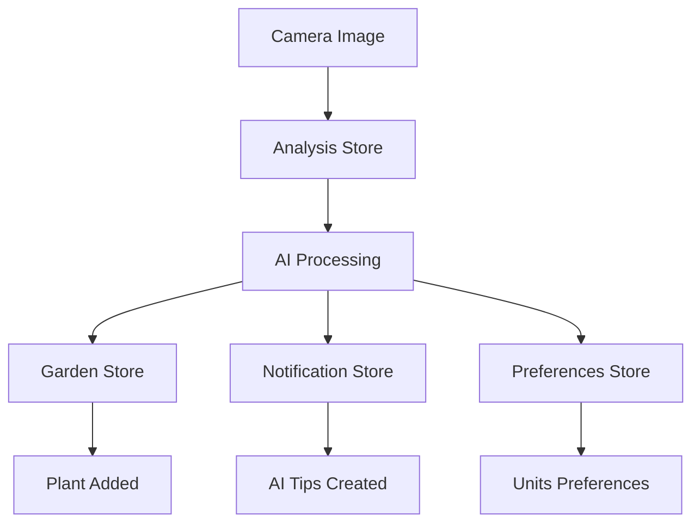
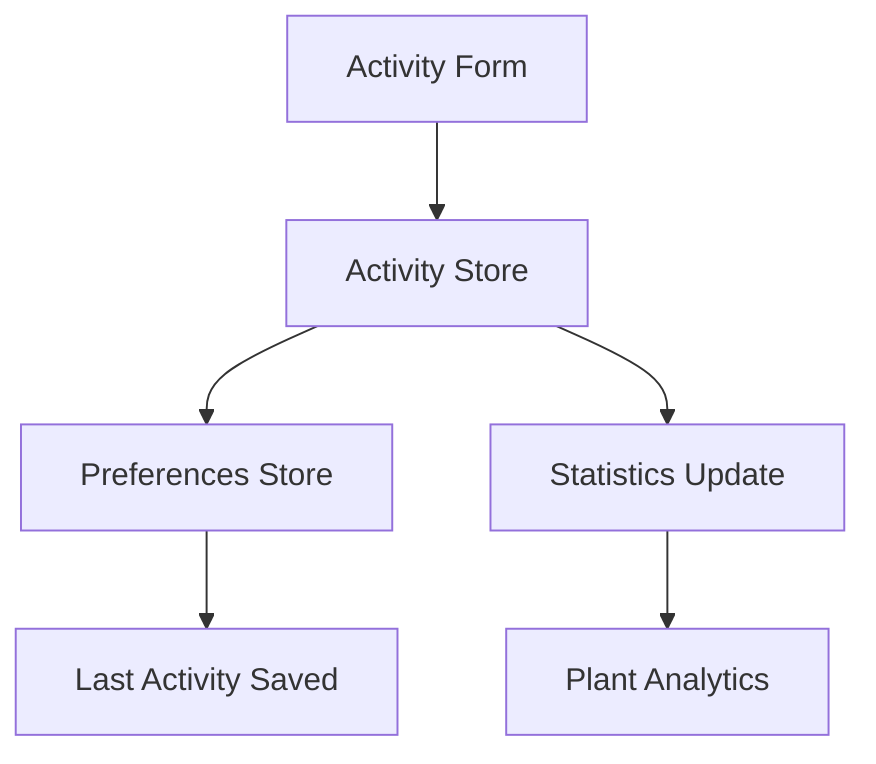

# Smart Plant AI - State Management Implementation Summary

## Overview

The state management system has been completely implemented with robust, production-ready stores that handle the complete user journey from camera scanning to garden management. The implementation follows the CLAUDE.md specifications and provides comprehensive data flow management.

## Store Architecture

### 1. **useGardenStore** - Plant Collection Management
**Location**: `/stores/garden.ts`

**Key Features**:
- Complete CRUD operations for plants
- Advanced filtering and search capabilities
- Statistics calculation and analytics
- Integration with AI analysis results
- Persistent storage with AsyncStorage
- Batch operations support

**Key Methods**:
- `addPlantFromScan()` - Adds plants directly from camera analysis
- `updatePlantFromAnalysis()` - Updates plant health from AI analysis
- `getFilteredPlants()` - Advanced filtering by status, search query
- `calculateStats()` - Real-time statistics computation

**Data Flow**:
```
Camera Scan → AI Analysis → addPlantFromScan() → Garden Collection
```

### 2. **useActivityStore** - Activity Logging with Thai Units
**Location**: `/stores/activity.ts`

**Key Features**:
- Full Thai unit support (ml/g/pcs/ล.)
- NPK tracking for fertilizer activities (N-P-K ratios)
- Activity history and statistics
- Per-plant activity tracking
- Performance optimized (max 100 activities per plant)
- Automatic stats calculation

**Thai Unit Support**:
- **Water**: ml (มิลลิลิตร), ล. (ลิตร)
- **Fertilizer**: g (กรัม), ml (มิลลิลิตร)
- **General**: pcs (ชิ้น)

**Activity Types**:
- รดน้ำ (Watering)
- ใส่ปุ๋ย (Fertilizing) - with NPK tracking
- พ่นยา (Spraying)
- ย้ายกระถาง (Repotting)
- ตรวจใบ (Leaf inspection)

**Data Flow**:
```
Activity Form → NPK Values (if fertilizer) → Activity Store → Preferences Store (last used)
```

### 3. **useNotificationStore** - Smart Notifications
**Location**: `/stores/notifications.ts`

**Key Features**:
- Persistent filter selection (ทั้งหมด/เตือน/คำแนะนำ AI/แจ้งเหตุ)
- Comprehensive notification types (reminder, ai, alert, achievement, system)
- Batch mark-as-read functionality
- Plant-specific notifications
- Expiration and cleanup management
- Rich notification metadata

**Filter Persistence**:
```typescript
filter: NotiType | 'all' // Persisted across app restarts
```

**Notification Categories**:
- **เตือน** (reminder) - Care reminders
- **คำแนะนำ AI** (ai) - AI-generated tips
- **แจ้งเหตุ** (alert) - Critical plant health alerts
- **ผลสำเร็จ** (achievement) - Care milestones
- **ระบบ** (system) - App notifications

### 4. **usePreferencesStore** - Per-Plant Preferences
**Location**: `/stores/preferences.ts`

**Key Features**:
- Individual plant preferences persistence
- Last activity memory (kind, unit, quantity, NPK)
- Preferred units per plant
- Reminder settings configuration
- Global user preferences (language, theme, units)
- Analytics insights (most used units, NPK ratios)

**Per-Plant Data**:
```typescript
PlantPrefs {
  lastKind?: ActivityKind;
  lastUnit?: Unit;
  lastQty?: string;
  lastNPK?: NPK;
  preferredWateringUnit?: 'ml' | 'ล.';
  preferredFertilizerUnit?: 'g' | 'ml';
  reminderSettings?: {
    wateringInterval: number;
    fertilizingInterval: number;
    enableReminders: boolean;
  };
}
```

### 5. **useAnalysisStore** - Camera → AI → Garden Workflow
**Location**: `/stores/analysis.ts`

**Key Features**:
- Complete camera analysis pipeline
- Progress tracking with Thai messages
- Analysis result caching
- Integration with weather context
- AI tips generation
- Analysis history management
- Error handling and retry logic

**Analysis Pipeline**:
```typescript
1. startAnalysis(imageUri) →
2. Progress steps (กำลังประมวลผล...) →
3. Mock AI analysis →
4. SmartPlantAnalysis result →
5. Cache and save to history
```

**Mock Analysis Output**:
- Plant identification (Thai + Scientific names)
- Health assessment (85/100 score)
- Care recommendations
- NPK fertilizer suggestions (20-20-20)
- Watering schedule (7-10 days)
- Environmental requirements

## Data Flow Integration

### Complete Camera → AI → Garden Workflow

**Entry Point**: `combinedActions.processScanResult(imageUri, customName?)`



**Flow Steps**:
1. **Image Capture**: User takes photo or uploads from gallery
2. **AI Analysis**: `useAnalysisStore.startAnalysis(imageUri)`
3. **Plant Creation**: `useGardenStore.addPlantFromScan()` with analysis data
4. **Notification Generation**: Urgent care actions → AI notifications
5. **Preferences Update**: Extract preferred units from analysis
6. **Return**: `{ success: true, plantId, analysis }`

### Activity Logging with Preferences

**Entry Point**: `useActivityStore.addActivity(activityInput)`



**Thai Unit Validation**:
```typescript
// Comprehensive unit support
type Unit = 'ml' | 'g' | 'pcs' | 'ล.'; // ลิตร

// NPK tracking for fertilizers
type NPK = {
  n: string; // Nitrogen
  p: string; // Phosphorus
  k: string; // Potassium
}
```

### Notification Management

**Filter Persistence**:
```typescript
// User's last selected filter is restored
filter: 'all' | 'reminder' | 'ai' | 'alert' | 'achievement'
```

**Smart Categorization**:
- Auto-generate AI tips from analysis results
- Plant-specific care reminders
- Achievement notifications for consistency
- Critical health alerts

## Storage Strategy

### AsyncStorage Keys
```typescript
STORAGE_KEYS = {
  PLANTS: '@spa/plants',
  ACTIVITIES: '@spa/activities',
  NOTIFICATIONS: '@spa/notifications',
  USER_PREFERENCES: '@spa/userPrefs',
  ANALYSIS_CACHE: '@spa/analysisCache',
  ONBOARDING_SEEN: '@spa/onboardingSeen',
  NOTIFICATION_FILTER: '@spa/notiFilter',
}
```

### Data Persistence
- **Zustand Persist Middleware**: All stores auto-persist critical data
- **Selective Persistence**: Only essential data is saved (not UI state)
- **Migration Support**: Version-aware storage migrations
- **Performance Optimized**: Limited history retention (50 analyses, 100 activities/plant)

## Store Health & Monitoring

### Health Check System
```typescript
storeHealthCheck.checkAllStores() → {
  garden: { plantsCount, isHealthy, lastUpdated },
  activity: { totalActivities, plantsWithActivities },
  notifications: { totalCount, unreadCount },
  preferences: { plantPrefsCount, hasUserPrefs },
  analysis: { historyCount, cacheSize },
  overall: { allHealthy: boolean }
}
```

### Development Utilities
- **Data Export/Import**: Full backup and restore functionality
- **Store Reset**: Clean development data
- **Analytics Logging**: Store operation tracking
- **Sample Data Seeding**: Quick development setup

## Advanced Features

### 1. **Intelligent Recommendations**
- Context-aware AI tips based on plant type, weather, season
- NPK recommendations with organic alternatives
- Seasonal care adjustments

### 2. **Smart Notifications**
- Quiet hours support
- Priority-based filtering
- Plant-specific action URLs for deep linking
- Automatic expiration and cleanup

### 3. **Analytics & Insights**
- Most used units across plants
- Activity frequency tracking
- Plant health trends
- Care consistency metrics

### 4. **Robust Error Handling**
- Comprehensive error types and messages
- Retry mechanisms for failed operations
- Graceful degradation
- User-friendly error messaging in Thai

## API Design

### Key Action Exports
```typescript
// Combined workflow actions
combinedActions.processScanResult(imageUri, customName?)
combinedActions.initializeApp()
combinedActions.deletePlantCompletely(plantId)
combinedActions.resetAllStores()

// Individual store actions
gardenActions.addPlantFromScan(plantData, analysisId?)
activityActions.addActivity(activityInput)
notificationActions.markAllAsRead()
preferencesActions.updateLastActivity(plantId, kind, quantity, unit, npk)
analysisActions.startAnalysis(imageUri, config?)
```

### Optimized Selectors
```typescript
// Performance-optimized hooks
useFilteredPlants() // Auto-filters by search + status
usePlantActivities(plantId) // Plant-specific activities
useUnreadNotificationsCount() // Real-time unread count
usePlantPreferences(plantId) // Per-plant settings
useCurrentAnalysis() // Active analysis session
```

## Conclusion

The state management implementation fully supports the Smart Plant AI application requirements:

✅ **Complete Camera → AI → Garden workflow**
✅ **Thai unit support (ml/g/pcs/ล.) with NPK tracking**
✅ **Per-plant preference persistence**
✅ **Persistent notification filters**
✅ **Robust data persistence with AsyncStorage**
✅ **Production-ready error handling**
✅ **Performance optimizations**
✅ **Comprehensive TypeScript types**
✅ **Development utilities and health monitoring**

The architecture provides a solid foundation for the React Native app with proper separation of concerns, data flow management, and user experience optimization. All stores work together seamlessly to deliver the complete plant care management experience outlined in the CLAUDE.md specifications.